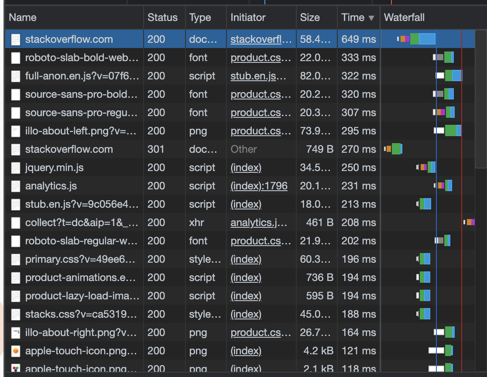

1. Код 301 Moved Permanently, получаем, так как делаем запрос к HTTP, а страница перемещена на HTTPS.
2. Код снова 301 по такой же причине. Дольше всего обрабатывался запрос к https://stackoverflow.com
   

3. 90.151.83.90
4. Провайдер - PJSC Rostelecom, Branch Ural, AS - AS12389
5. IP адреса:
 - 80.71.208.96
 - 87.226.151.154
 - 87.226.146.128
 - 87.226.183.89
 - 87.226.181.89
 - 87.226.183.89
 - 5.143.253.245
 - 5.143.253.105
 - 5.143.253.245
 - 108.170.250.130
 - 108.170.250.34
 - 108.170.250.130
 - 142.251.49.78
 - 72.14.235.69
 - 108.170.232.251
 - 216.239.49.3
 - 108.170.233.161
 - 172.253.64.113
AS: AS12389 и AS15169
6. Наибольшее среднее время имеет 142.250.239.64, наибольшее худшее время имеет 108.170.233.163

 ```Host                                                Loss%   Snt   Last   Avg  Best  Wrst StDev
 1. AS???    192.168.1.1                              0.0%  1258    3.2   3.7   2.0  61.7   4.0
 2. AS12389  80.71.208.96                             0.0%  1258    7.0   8.9   3.3 204.8  10.3
 3. AS12389  87.226.151.154                           0.0%  1258    4.8   8.0   3.1 152.8   8.0
 4. AS12389  87.226.146.128                           0.0%  1258    5.5   8.1   3.6 104.8   5.9
 5. AS12389  87.226.183.89                            0.0%  1258   68.7  38.6  33.8 102.4   6.1
 6. AS12389  5.143.253.105                            0.0%  1258   37.8  38.9  33.9 174.5   9.2
 7. AS15169  108.170.250.146                         11.8%  1258   40.3  41.4  36.0 169.4   9.0
 8. AS15169  142.250.239.64                          66.6%  1258   55.6  58.3  53.1 111.0   7.1
 9. AS15169  74.125.253.109                           0.0%  1258   53.1  54.7  48.8 114.1   8.5
10. AS15169  108.170.233.163                          0.0%  1258   52.4  53.1  48.6 581.2  16.1 
```
7. 
DNS сервера: 
   - ns1.zdns.google.
   - ns2.zdns.google.
   - ns3.zdns.google.
   - ns4.zdns.google. 
   
IP адреса: 
   - 8.8.8.8, 
   - 8.8.4.4
8. Проверил записи. Обеим принадлежит dns.google.
